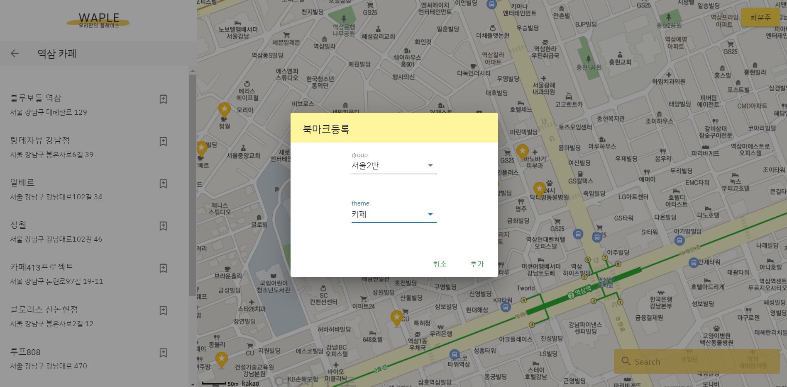
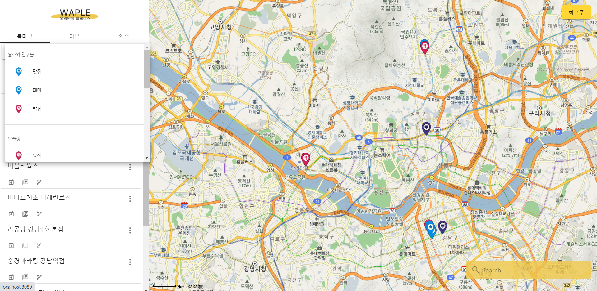
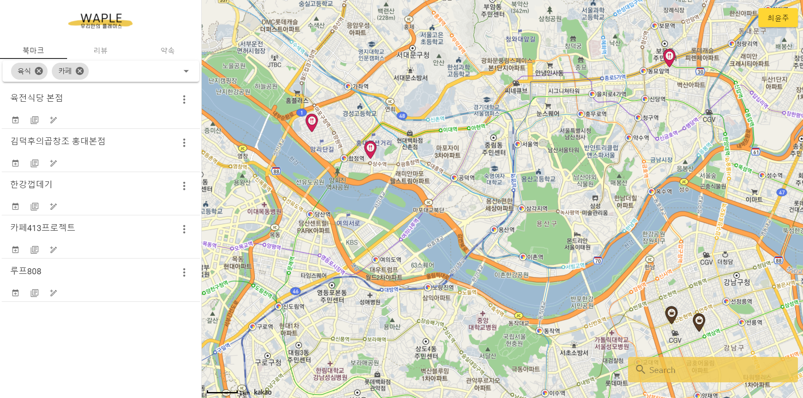
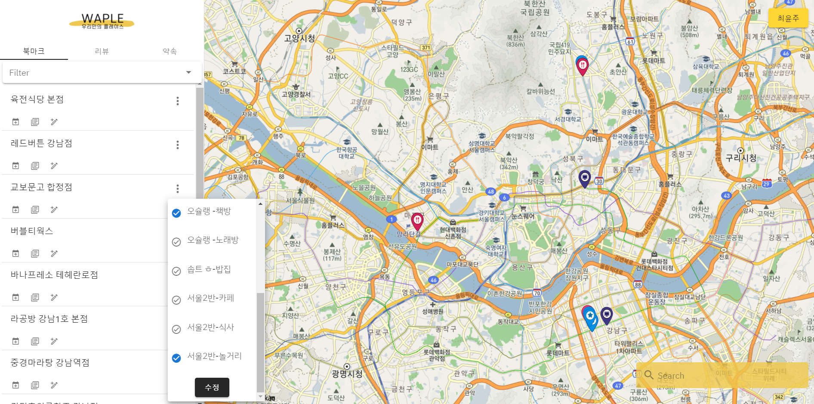
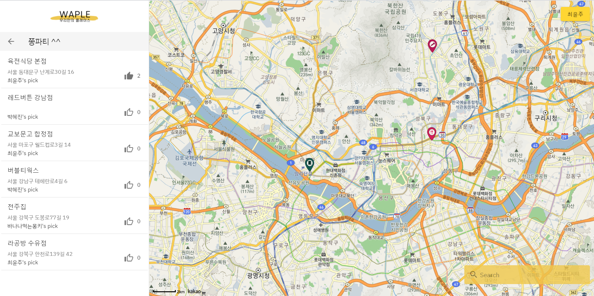
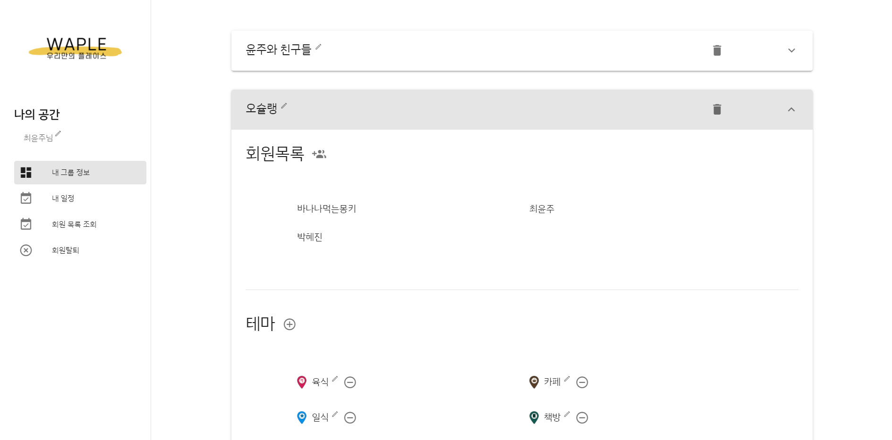
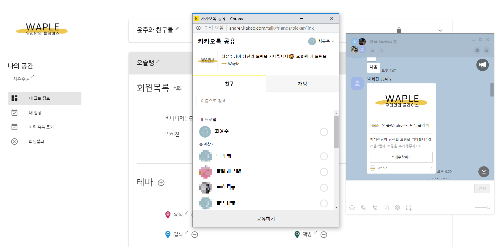
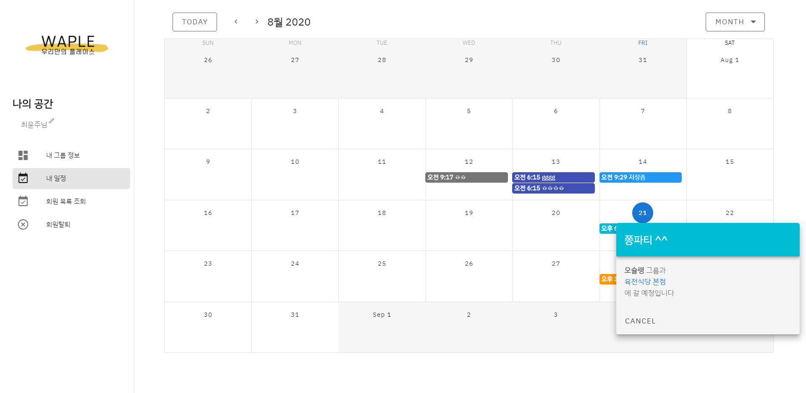

# 🥞 와플 Waple : 우리만의 플레이스

> 한개의 와플 빵 위에 각자의 취향에 맞는 토핑을 올려 먹듯,
> 하나의 지도에 모임별 기록을 담아내는 와플 서비스!!!

### [WaPle 놀러가기](http://i3a204.p.ssafy.io:8888)

  

# 😎 와플만의 특징

- **각자 모임별로 만드는 맞춤형 지도**
- 친구들과 함께 만드는 지도
- 그 시절, 그 상황이 기억나는 지도
- 그룹 내 멤버들끼리 지도 공유
- 직접 지정한 테마 별 지도 보기
- 방문했던 모든 장소에 대한 리뷰 남기기
- 간편하게 약속 잡기
- 캘린더에서 약속 모아보기

  

# 🤷 Why WaPle?

- 공유성
  - 원하는 장소를 원하는 그룹과 함께 볼 수 있다
  - 같은 그룹 내에서 쓰여진 리뷰를 읽을 수 있다
- 기록성
  - 그룹 내의 약속을 기록할 수 있다
  - 방문 내역을 리뷰 기능을 통해 기록할 수 있다
- 폐쇄성
  - 초대된 멤버만 그룹에 속할 수 있다

  

# 🚀 기능

## 검색

- 카카오 지도 API 사용
- 장소의 위치와 정보를 확인할 수 있다

 

## 북마크 등록

- 검색 후 그룹과 공유하고 싶은 장소를 북마크에 등록

 

## 테마별 필터 기능

- 등록된 북마크를 그룹, 테마별로 선택하여 볼 수 있다

 

## 북마크 수정

- 저장된 북마크는 다른 테마에 쉽게 추가할 수 있다
- 모든 선택이 해제되면 북마크 삭제가 가능하다

 

## 약속 만들기

- 편리하게 그룹원들과 약속을 잡을 수 있다
- 약속 내에 여러 개의 장소를 추가할 수 있다

 

## 약속 장소 정하기

- 저장된 장소들 중 가고 싶은 곳에 투표를 할 수 있다
- 여러 장소에 투표가 가능하다

 

## 리뷰 쓰기

- 저장한 장소에 대해 리뷰 작성을 할 수 있다
- 제목, 함께 다녀온 그룹, 방문 날짜, 내용, 사진을 넣을 수 있다

 

## 리뷰 읽기

- 본인이 속한 그룹의 리뷰들을 읽을 수 있다

 

## 리뷰에 등록된 사진 보기

- 리뷰에 등록된 사진은 확대하여 볼 수 있다

 

## 내 그룹

- 내가 속한 그룹의 정보를 볼 수 있다
- 그룹 이름 변경 가능
- 테마 추가, 수정 가능

 

## 멤버 초대하기

- 카카오톡 메시지 공유를 통해 멤버를 초대할 수 있다

 

## 일정 확인하기

- 달력을 통해 내가 속한 그룹의 약속을 확인할 수 있다
- 어떤 그룹과 어떤 장소에 가기로 했는지 확인할 수 있다

  

# 🔥 개발
## 👩‍👧‍👦 Team Toppings

- 박혜진
  - **팀장**
  - 사과잼
  - 서버
  - [github](https://github.com/du-dung)
- 오인호
  - 노잼
  - 서버
  - [github](https://github.com/kickrisk)
- 최윤주
  - 루비잼
  - 프론트
  - [github](https://github.com/yeomju311)
  - [blog](https://yeomju311.github.io/)

 

## 📅 개발기간
2020.07.07 ~ 2020.08.21

 

## 💻 사용 기술
### backend

- `RESTful`
- `MariaDB`
- Library
  - Java-JWT
  - aspectj

 

### Frontend

 

- API
  - Kakao Login
  - Kakao Map
  - Kakao Link
- Library
  - axios
  - vue-session
  - moment
  - vue-toastification
  - vue-upload-multiple-image
  - vee-validate

 

### 관리

- docker
- git
- JIRA
- AWS EC2
- nginx